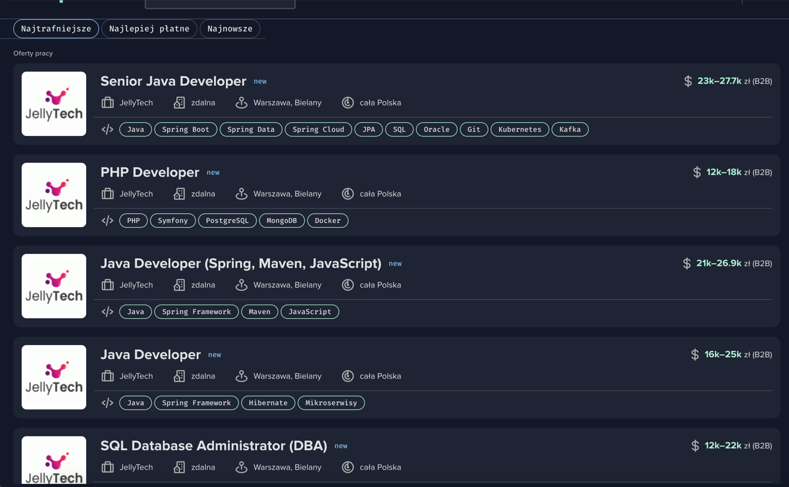
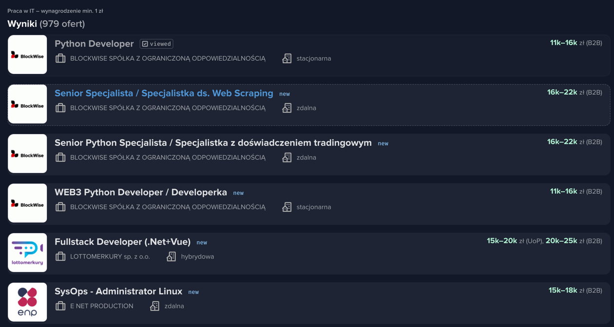

## Projekt zaliczeniowy z przedmiotu PAD
### Temat: Analiza danych z serwisu theprotocol.it
### Autorzy:
Daniel Szepietowski
### Opis projektu
Celem projektu jest analiza danych z serwisu theprotocol.it, który jest serwisem z ofertami pracy dla programistów.
Projekt składa się z trzech części:
1. Skryptu do pobierania danych z serwisu theprotocol.it
2. Jupyter notebooka do czyszczenia danych
3. Dashboardu do analizy danych
## Dlaczego jest to problem regresji liniowej?
Problem regresji liniowej polega na przewidywaniu wartości zmiennej ciągłej na podstawie innych zmiennych. 
W naszym przypadku chcemy przewidzieć wartość wynagrodzenia na podstawie innych zmiennych, takich jak lokalizacja, technologie, doświadczenie, itp.

## Jupyter notebook
1. W celu uruchomienia notebooka należy uruchomić plik `data_cleanup.ipynb` w środowisku Jupyter Notebook.
2. W notebooku znajduje się kod do czyszczenia danych, który należy uruchomić.
3. Po uruchomieniu kodu w notebooku, dane zostaną zapisane do pliku `job_offers_cleaned.csv`.
## Uruchamianie dashboardu
1. W celu uruchomienia dashboardu należy uruchomić skrypt `dashboard.py`,
komendą `streamlit run dashboard.py`. Skrypt ten uruchamia dashboard na lokalnym serwerze.
## Uruchamianie modelu
1. W celu uruchomienia modelu należy uruchomić skrypt `model_regression.py`.
2. Skrypt ten wczytuje dane z pliku `job_offers_cleaned.csv`, dzieli je na zbiór treningowy i testowy, a następnie trenuje model regresji liniowej.

### Niestety strona zmienila swoj layout kilka dni przed oddaniem projektu, przez co skrypt do pobierania danych nie dziala poprawnie.
Tak wygladal stary layout strony:

Tak wyglada nowy:

Zniknelo wiec sporo informacji o technologiach w ofercie pracy, lokalizacji, oraz zmienily sie nazwy pól, divów, etc.
Trzeba bt zmodyfikowac skrypt, jednak stracilbym sporo przydatnych informacji, wiec zdecydowalem sie zostawic stary skrypt.